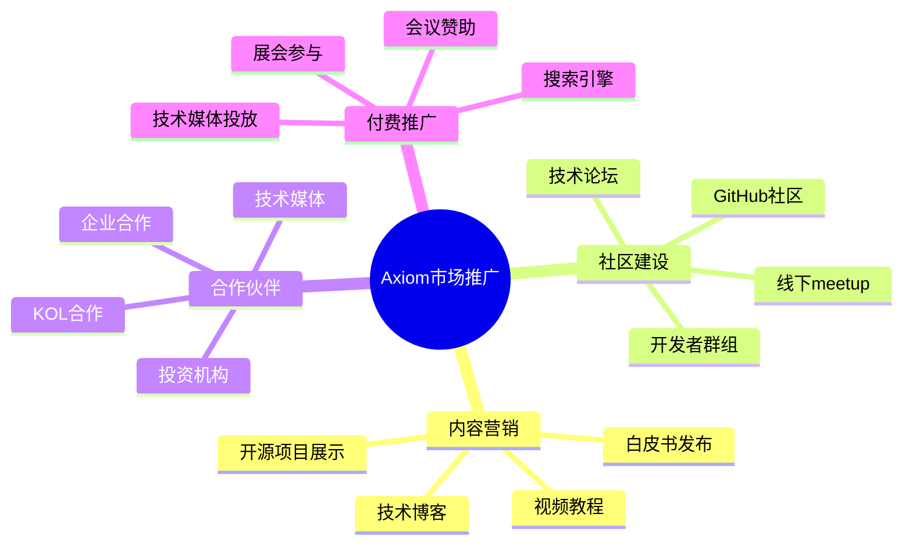
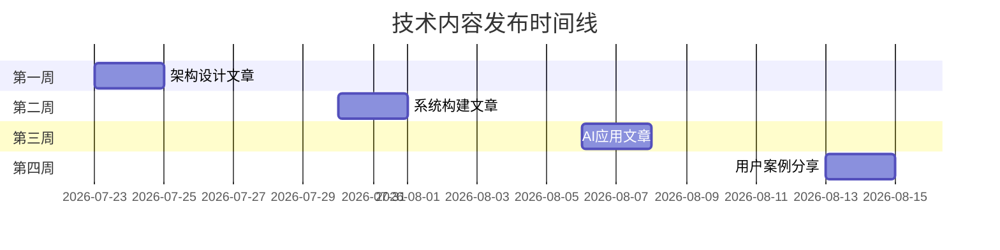
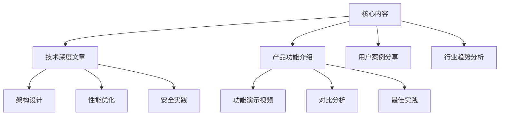
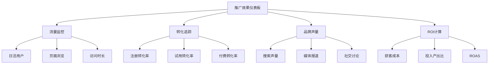

# 🚀 Axiom平台市场推广行动方案

## 🎯 推广策略总览

## 📝 第一阶段：内容营销 (7-8月)

### 技术博客系列

#### 核心文章规划
1. **《现代企业开发协作平台的架构设计》**
   - 发布平台：掘金、思否、知乎
   - 内容重点：微服务架构、云原生设计
   - 预期阅读：10000+

2. **《从零到一：如何构建高可用的团队协作系统》**
   - 发布平台：InfoQ、CSDN
   - 内容重点：技术选型、最佳实践
   - 预期阅读：8000+

3. **《AI驱动的项目管理：未来协作方式探索》**
   - 发布平台：机器之心、36氪
   - 内容重点：AI应用场景、技术实现
   - 预期阅读：15000+

#### 内容发布计划

### 开源项目展示

#### GitHub仓库优化
1. **README完善**
   - 添加详细的功能介绍
   - 提供在线Demo链接
   - 展示架构图和技术栈

2. **文档站点建设**
   - 使用VitePress搭建文档站
   - 提供API文档和集成指南
   - 添加最佳实践案例

3. **社区活动**
   - 定期发布Release Notes
   - 回应Issues和PR
   - 组织Contributor活动

## 🌐 第二阶段：社区建设 (8-9月)

### 技术社区运营

#### 平台策略
| 平台 | 目标粉丝 | 内容策略 | KPI指标 |
|------|----------|----------|---------|
| 掘金 | 5000+ | 技术深度文章 | 10篇10万阅读 |
| 知乎 | 3000+ | 问答+专栏 | 50个回答1万赞 |
| GitHub | 1000+ | 开源项目 | 1000 Stars |
| 微博 | 2000+ | 技术资讯 | 100万曝光 |

#### 内容矩阵

### 线下活动组织

#### Meetup系列
1. **北京站**：《云原生时代的协作平台设计》
2. **上海站**：《AI如何重塑软件开发流程》
3. **深圳站**：《企业级DevOps实践分享》
4. **杭州站**：《开源协作工具的发展趋势》

#### 会议演讲
- **QCon全球软件开发大会** (9月)
- **ArchSummit架构师峰会** (10月)  
- **GTLC全球技术领导力峰会** (11月)
- **KubeCon云原生大会** (12月)

## 🤝 第三阶段：合作伙伴 (9-10月)

### 技术媒体合作

#### 重点媒体列表
1. **InfoQ中国** - 技术深度报道
2. **CSDN** - 开发者社区推广
3. **51CTO** - 企业级市场覆盖
4. **OSChina** - 开源社区影响力
5. **掘金** - 年轻开发者群体

#### 合作形式
- 专访报道：创始人/技术负责人专访
- 技术专题：深度技术解析文章
- 产品评测：第三方中立评测报告
- 联合活动：共同举办技术沙龙

### KOL意见领袖合作

#### 目标KOL
1. **技术博主** (10人)
   - 粉丝量：10万+
   - 专业领域：软件架构、DevOps
   - 合作方式：产品体验+深度评测

2. **开源维护者** (5人)
   - 项目Star：5000+
   - 影响领域：协作工具、开发效率
   - 合作方式：产品集成+推荐使用

3. **企业CTO** (8人)
   - 公司规模：100人+
   - 行业领域：互联网、金融、制造
   - 合作方式：案例合作+经验分享

## 💰 第四阶段：付费推广 (10-12月)

### 搜索引擎营销

#### 关键词策略
**核心词汇**:
- "团队协作工具"
- "项目管理软件" 
- "开发者协作平台"
- "企业级DevOps平台"

**长尾词汇**:
- "类似JIRA的开源工具"
- "比Slack更好的团队沟通工具"
- "支持中国本土化的协作平台"

#### 投放预算 (月度)
- **百度SEM**: 10万元
- **谷歌Ads**: 5万元  
- **360搜索**: 2万元
- **搜狗推广**: 2万元

### 技术媒体投放

#### 精准投放策略
| 媒体平台 | 目标人群 | 投放形式 | 月预算 |
|----------|----------|----------|--------|
| InfoQ | 技术决策者 | 信息流+专题 | 8万元 |
| CSDN | 开发工程师 | banner+内容 | 6万元 |
| 掘金 | 年轻开发者 | 推荐位+活动 | 4万元 |
| 51CTO | 企业IT | 专题+白皮书 | 5万元 |

## 📊 推广效果评估

### 核心指标体系

#### 品牌认知指标
- **品牌搜索量**: 月度"Axiom平台"搜索次数
- **媒体曝光量**: 各媒体平台总曝光次数
- **社交声量**: 微博、知乎、论坛讨论量
- **内容传播**: 原创内容的转发分享数

#### 用户获取指标  
- **网站流量**: 官网UV、PV、停留时间
- **注册转化**: 访问到注册的转化率
- **试用激活**: 注册到实际使用的转化率
- **付费转化**: 试用到付费的转化率

#### 参与度指标
- **社区活跃度**: GitHub仓库星标、Fork、Issues
- **内容互动**: 文章点赞、评论、分享数量
- **活动参与**: 线下活动报名和到场人数
- **用户反馈**: 产品评分和用户评价

### 数据追踪工具

#### 分析平台
1. **Google Analytics** - 网站流量分析
2. **神策数据** - 用户行为分析
3. **友盟统计** - 移动端数据分析
4. **微博数据中心** - 社交媒体监控

#### 监控仪表板

## 🎯 执行时间表

### Q3 2025 (7-9月) 重点任务
**7月下旬**:
- [ ] 完善GitHub仓库和文档
- [ ] 发布首篇技术博客
- [ ] 启动内测用户招募
- [ ] 建立官方技术群组

**8月份**:
- [ ] 发布2-3篇深度技术文章
- [ ] 参与5个技术论坛讨论
- [ ] 组织第一场线下meetup
- [ ] 联系10个技术媒体合作

**9月份**:
- [ ] 参与QCon大会演讲
- [ ] 发布第一个PR视频
- [ ] 启动KOL合作计划
- [ ] 完成100个内测用户

### Q4 2025 (10-12月) 重点任务
**10月份**:
- [ ] 启动付费推广投放
- [ ] 参与ArchSummit演讲
- [ ] 发布企业版功能
- [ ] 建立合作伙伴网络

**11月份**:
- [ ] 参与GTLC峰会
- [ ] 发布年度白皮书
- [ ] 开展企业客户案例
- [ ] 筹备融资路演

**12月份**:
- [ ] 参与KubeCon大会
- [ ] 发布年终总结报告
- [ ] 制定次年战略规划
- [ ] 庆祝平台正式商业化

## 💡 创新推广想法

### 病毒式营销
1. **#AxiomChallenge挑战赛**
   - 邀请开发团队展示协作成果
   - 最佳团队获得1年免费企业版
   - 社交媒体病毒式传播

2. **开发者表情包**
   - 设计Axiom主题开发者表情包
   - 在开发者群组中自然传播
   - 增强品牌亲和力

3. **技术播客合作**
   - 与知名技术播客合作
   - 分享创业和技术故事
   - 影响技术意见领袖

### 差异化定位
1. **"为中国开发者而生"**
   - 强调本土化特性
   - 支持中国主流开发工具
   - 符合中国企业使用习惯

2. **"AI驱动的下一代平台"**
   - 突出AI技术应用
   - 展示智能化特色功能
   - 定位技术创新先锋

---

## 🏆 预期成果

通过系统化的市场推广，预期在12个月内实现：

- **品牌知名度**: 在开发者群体中达到15%认知度
- **用户规模**: 注册用户突破10万，付费用户1000+
- **市场地位**: 成为国内前三的企业协作平台
- **商业价值**: 月收入达到100万元，估值5亿元

**让Axiom成为每个开发团队的首选协作平台！** 🚀