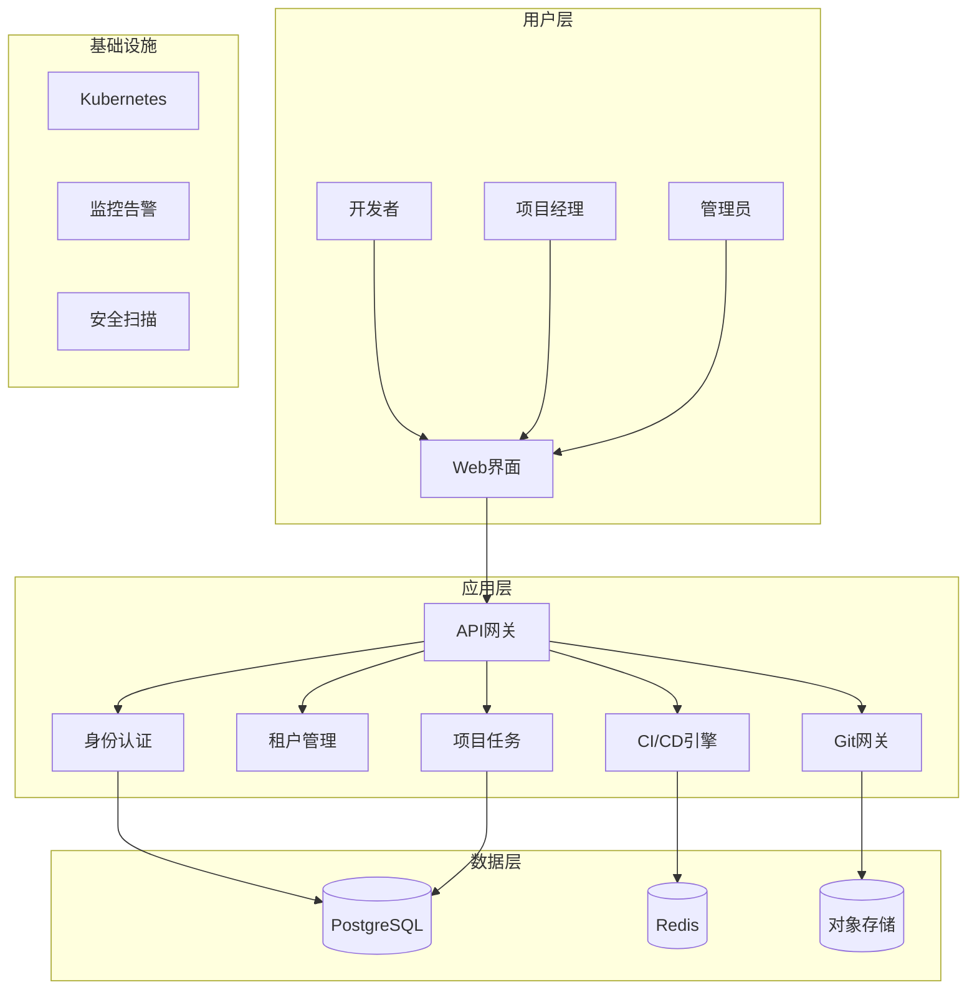

# 🚀 Axiom - 企业级智能开发协作平台

<div align="center">


**Axiom** - 为开发者创造的下一代云端协作平台

[](https://github.com/your-org/axiom/actions)
[](https://github.com/your-org/axiom/security)
[](LICENSE)

[快速开始](#快速开始) •
[文档](docs/) •
[演示](https://demo.axiom-platform.com) •
[社区](https://github.com/your-org/axiom/discussions)

</div>

## ✨ 项目愿景

> "我们不创造天才，我们只是为天才们，构建一个配得上他们智慧的宇宙。"

**Axiom** 是一个面向企业级开发团队的现代化协作平台，致力于通过消除开发流程中的摩擦，释放团队的创造力。我们相信，最好的工具应该是隐形的 - 让开发者专注于创造，而非与工具搏斗。

### 🎯 核心目标

- **🌊 开发者心流至上**: 设计每个功能时都以"不打断开发者思路"为第一原则
- **🏢 企业级安全可靠**: 内建零信任架构，满足最严格的企业安全要求  
- **📊 数据驱动决策**: 通过DORA指标等工程效能数据，帮助团队持续改进
- **🔄 无缝集成体验**: 与现有开发工具链深度集成，而非替代

## 🏗️ 核心架构



## 🚀 快速开始

### 前置要求

- **Go** 1.21+
- **Node.js** 18+  
- **Docker** & Docker Compose
- **Kubernetes** (生产环境)

### 本地开发环境

```bash
# 克隆项目
git clone https://github.com/your-org/cloud-platform.git
cd cloud-platform

# 一键启动完整开发环境
make quick-start

# 等待服务启动完成...
# 🎉 开发环境已就绪!

# 构建服务
make build

# 运行测试
make test

# 启动前端开发服务器
make web-dev
```

### 🔗 服务访问地址

启动成功后，你可以访问以下服务：

| 服务 | 地址 | 用途 |
|------|------|------|
| 🌐 **主平台** | http://localhost:3000 | 核心协作界面 |
| 📊 **监控面板** | http://localhost:3001 | Grafana (admin/admin123) |
| 🔧 **Git服务** | http://localhost:3000 | Gitea Git托管 |
| 📈 **指标查询** | http://localhost:9090 | Prometheus |
| 🔍 **链路追踪** | http://localhost:16686 | Jaeger |
| 🗂️ **对象存储** | http://localhost:9001 | MinIO (minioadmin/minioadmin123) |

## 📋 核心功能

### 🏢 多租户管理
- **自助式租户注册** - 企业可快速创建独立实例
- **灵活的权限体系** - 支持租户级和项目级RBAC
- **资源配额管理** - 精确控制每个租户的资源使用

### 📝 项目协作
- **敏捷看板** - 直观的任务管理和进度跟踪
- **实时协作** - WebSocket支持的实时更新
- **智能通知** - 基于上下文的通知系统

### 🔄 CI/CD集成
- **声明式管道** - YAML配置的灵活管道定义
- **并行执行** - 基于Tekton的云原生CI/CD
- **安全扫描** - 内建SAST/SCA/容器扫描

### 📚 知识管理
- **Markdown文档** - 支持实时协作编辑
- **版本控制** - 文档的完整变更历史
- **全局搜索** - 跨项目的智能搜索

### 🔒 企业级安全
- **零信任架构** - 所有访问都需验证和授权
- **数据加密** - 传输和存储的端到端加密
- **审计日志** - 完整的操作记录和合规报告

## 🏭 生产部署

### Kubernetes部署

```bash
# 使用Helm部署
cd configs/helm
helm install cloud-platform ./cloud-platform \
  --namespace cloud-platform \
  --create-namespace \
  --values values.prod.yaml

# 或使用原生K8s配置
kubectl apply -f configs/kubernetes/
```

### 基础设施即代码

```bash
# 使用Terraform管理云资源
cd configs/terraform
terraform init
terraform plan
terraform apply
```

## 🧪 测试策略

我们采用**测试金字塔**策略，确保代码质量：

```bash
# 单元测试 (80%)
make test

# 集成测试 (15%)
make test-integration

# E2E测试 (5%)
make test-e2e

# 性能测试
make test-performance

# 安全测试
make security-scan
```

### 测试覆盖率目标

- **后端服务**: 单元测试覆盖率 > 80%
- **前端组件**: 测试覆盖率 > 75%
- **关键路径**: E2E测试覆盖率 100%

## 📊 可观测性

### 三支柱监控

1. **📈 指标 (Metrics)** - Prometheus + Grafana
   - 业务指标：DORA metrics, 用户活跃度
   - 技术指标：服务性能, 错误率, 延迟

2. **📝 日志 (Logs)** - ELK Stack
   - 结构化JSON日志
   - 集中收集和分析
   - 告警和异常检测

3. **🔍 追踪 (Traces)** - Jaeger
   - 分布式请求追踪
   - 性能瓶颈识别
   - 服务依赖分析

## 🤝 开发规范

### Git工作流

我们使用 **Git Flow** 简化版：

```
main    ←─── release/v1.2.0 ←─── develop ←─── feature/new-auth
  ↑                                ↑
hotfix/critical-fix ──────────────┘
```

### 代码提交规范

```bash
# 使用 Conventional Commits
feat(auth): add multi-factor authentication support
fix(api): resolve JWT token expiration issue  
docs(readme): update installation instructions
test(user): add user service integration tests
```

### 代码审查要求

- ✅ 所有PR必须通过CI检查
- ✅ 至少1位reviewer批准
- ✅ 测试覆盖率不降低
- ✅ 安全扫描通过
- ✅ 性能无回归

## 🌟 贡献指南

我们欢迎所有形式的贡献！请参阅 [CONTRIBUTING.md](CONTRIBUTING.md) 了解详情。

### 快速贡献步骤

1. **Fork** 本仓库
2. 创建功能分支 (`git checkout -b feature/amazing-feature`)  
3. 提交变更 (`git commit -m 'feat: add amazing feature'`)
4. 推送分支 (`git push origin feature/amazing-feature`)
5. 创建 **Pull Request**

## 📄 许可证

本项目采用 MIT 许可证 - 查看 [LICENSE](LICENSE) 文件了解详情。

## 🙏 致谢

感谢所有为这个项目做出贡献的开发者！

<a href="https://github.com/your-org/cloud-platform/graphs/contributors">
  
</a>

## 📞 联系我们

- 🌐 **官网**: https://axiom.com
- 💬 **讨论区**: https://github.com/your-org/cloud-platform/discussions  
- 📧 **邮箱**: team@axiom.com
- 🐦 **Twitter**: @EuclidElements

---

<div align="center">
  <strong>Axiom，因逻辑而生，为奇点而存。</strong><br>
  <em>让我们一起为开发者构建一个配得上他们智慧的宇宙。</em>
</div>