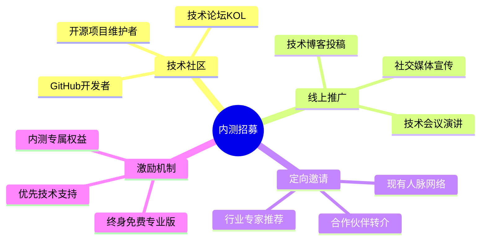
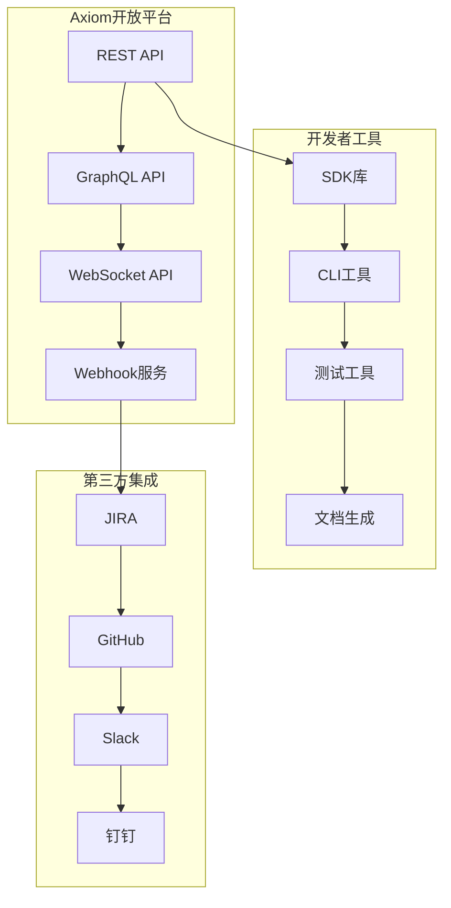
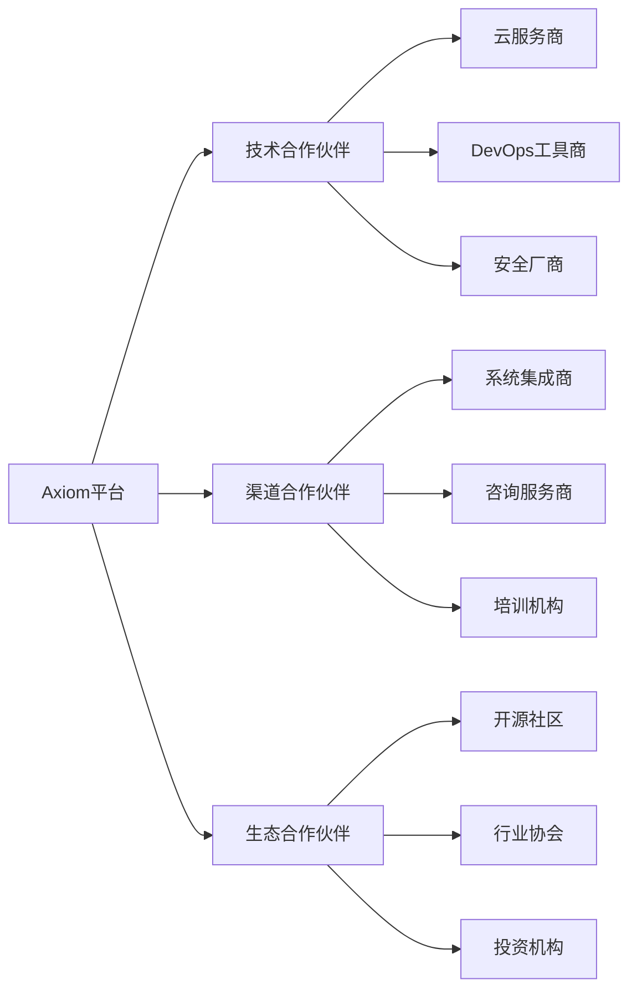

# 📋 Axiom平台后续发展计划

## 🎯 第一阶段：市场验证 (2025年7-8月，2周)

### 📊 目标设定
- **核心目标**: 验证产品市场契合度(PMF)
- **用户目标**: 招募100名内测用户
- **技术目标**: 系统稳定性达到99.5%
- **反馈目标**: 收集500+条有效反馈

### 👥 内测用户招募策略

#### 目标用户画像
1. **技术团队负责人**
   - 10-50人的研发团队
   - 有协作痛点和改进需求
   - 对新技术接受度高

2. **创业公司CTO**
   - 寻求高效开发流程
   - 预算有限但重视效率
   - 愿意尝试新工具

3. **开源项目维护者**
   - 需要管理贡献者和项目
   - 有社区影响力
   - 可以带来口碑传播

#### 招募渠道


### ⚡ 性能压测计划

#### 测试场景设计
1. **并发用户测试**
   - 1000个并发用户同时操作
   - 模拟真实使用场景
   - 监控响应时间和吞吐量

2. **数据压力测试**
   - 10万个项目数据
   - 100万个任务记录
   - 验证数据库性能

3. **API接口测试**
   - 每秒1000次API调用
   - 测试各个服务的稳定性
   - 验证熔断和限流机制

#### 性能指标要求
- 页面加载时间 < 2秒
- API响应时间 < 500ms
- 系统可用性 > 99.5%
- 错误率 < 0.1%

### 📝 用户反馈收集机制

#### 收集方式
1. **定期访谈**: 每周电话访谈5-10位核心用户
2. **问卷调研**: 月度使用体验问卷
3. **行为数据**: 用户操作热力图和路径分析
4. **BUG追踪**: GitHub Issues实时反馈

#### 关键指标监控
- 用户留存率 (日/周/月)
- 功能使用频次统计
- 用户满意度评分
- NPS净推荐值

## 🚀 第二阶段：功能增强 (2025年8-9月，1个月)

### 📱 移动端APP开发

#### 功能优先级
```mermaid
graph TB
    A[移动端核心功能] --> B[项目概览]
    A --> C[任务管理]
    A --> D[通知消息]
    A --> E[团队沟通]
    
    B --> B1[仪表盘数据]
    B --> B2[项目进度]
    C --> C1[任务查看]
    C --> C2[状态更新]
    D --> D1[推送通知]
    D --> D2[消息中心]
    E --> E1[评论回复]
    E --> E2[@提醒]
```

#### 技术选型
- **跨平台框架**: React Native
- **状态管理**: Redux Toolkit
- **导航**: React Navigation
- **推送服务**: Firebase Cloud Messaging
- **离线存储**: AsyncStorage + SQLite

### 🤖 AI辅助功能开发

#### AI功能规划
1. **智能任务分解**
   - 自动将复杂任务拆分为子任务
   - 基于历史数据推荐工时估算
   - 智能分配给最适合的团队成员

2. **代码智能分析**
   - 自动代码审查和建议
   - 安全漏洞检测
   - 性能优化推荐

3. **项目健康度预警**
   - 基于DORA指标的项目风险评估
   - 延期风险预测和预警
   - 团队效能分析和改进建议

#### 技术实现
- **AI服务**: 集成GPT-4/Claude API
- **机器学习**: TensorFlow.js本地推理
- **数据分析**: Python数据科学栈
- **实时计算**: Apache Kafka + Spark

### 📊 高级数据分析报表

#### 报表类型
1. **团队效能分析**
   - DORA四大指标趋势
   - 个人贡献度评估
   - 团队协作网络图

2. **项目洞察报告**
   - 项目健康度评分
   - 里程碑完成情况
   - 资源利用率分析

3. **业务价值衡量**
   - 功能价值ROI计算
   - 用户故事完成效率
   - 业务目标达成度

## 🌟 第三阶段：生态建设 (2025年9-10月，1.5个月)

### 🔗 开放API平台

#### API生态架构


#### 开发者生态
1. **SDK和工具**
   - JavaScript/Python/Go/Java SDK
   - CLI命令行工具
   - Postman Collection
   - OpenAPI 3.0文档

2. **开发者门户**
   - API文档和示例
   - 开发者社区论坛
   - 应用注册和管理
   - 使用量监控仪表板

### 🔌 插件市场建设

#### 插件生态规划
1. **官方插件**
   - 主流工具集成 (GitHub, GitLab, Jenkins)
   - 通信工具集成 (Slack, Teams, 钉钉)
   - 项目管理集成 (JIRA, Trello, Notion)

2. **第三方插件**
   - 开发者贡献插件
   - 企业定制插件
   - 社区维护插件

3. **插件开发框架**
   - 插件开发SDK
   - 本地调试工具
   - 插件商店上架流程

### 🌐 社区版发布

#### 版本差异化
| 功能 | 社区版 | 专业版 | 企业版 |
|------|--------|--------|--------|
| 用户数 | 10人 | 100人 | 无限制 |
| 项目数 | 5个 | 50个 | 无限制 |
| 存储空间 | 5GB | 100GB | 1TB+ |
| AI功能 | 基础 | 高级 | 定制 |
| 技术支持 | 社区 | 邮件 | 7x24热线 |

## 💼 第四阶段：商业化运营 (2025年10月-12月，3个月)

### 🏢 企业级功能开发

#### 企业特性
1. **高级安全功能**
   - SSO单点登录
   - LDAP/AD集成
   - 数据防泄漏(DLP)
   - 合规审计报告

2. **私有部署支持**
   - 本地化部署方案
   - 混合云架构
   - 数据主权保护
   - 定制化开发

3. **高级管理功能**
   - 多租户管理
   - 资源配额控制
   - 成本核算分析
   - SLA服务保障

### 🌍 全球市场推广

#### 市场策略
1. **产品本地化**
   - 多语言支持 (中英日韩)
   - 本土化功能适配
   - 当地合规要求
   - 文化差异考虑

2. **渠道建设**
   - 代理商网络
   - 系统集成商合作
   - 云服务商联盟
   - 技术媒体推广

3. **品牌建设**
   - 技术会议演讲
   - 白皮书发布
   - 客户成功案例
   - 行业报告参与

### 🤝 合作伙伴生态

#### 生态合作模式


## 📈 关键成功指标 (KPI)

### 第一阶段目标
- 内测用户: 100名
- 用户留存率: >70%
- 系统稳定性: >99.5%
- 用户满意度: >4.5/5

### 第二阶段目标
- 功能完成度: 100%
- 移动端用户: 500名
- AI功能使用率: >60%
- 新增付费用户: 50名

### 第三阶段目标
- 开放API调用: 100万次/月
- 第三方插件: 20个
- 开发者注册: 1000名
- 社区版用户: 5000名

### 第四阶段目标
- 企业客户: 100家
- 月收入: 100万元
- 全球用户: 10万名
- 市场估值: 5亿元

## 🎯 执行建议

### 立即行动项 (本周)
1. 启动内测用户招募活动
2. 开始性能压测准备工作
3. 设计用户反馈收集流程
4. 组建移动端开发团队

### 重点关注领域
1. **用户体验优化**: 持续改进产品易用性
2. **技术架构升级**: 支撑更大规模用户
3. **商业模式验证**: 找到可持续盈利模式
4. **团队能力建设**: 扩大研发和运营团队

### 风险管控
1. **技术风险**: 多环境测试，灰度发布
2. **市场风险**: 多渠道验证，快速迭代
3. **竞争风险**: 差异化定位，护城河建设
4. **资金风险**: 融资规划，成本控制

---

## 🚀 总结

Axiom平台已经具备了从0到1的完整能力，现在需要实现从1到100的规模化发展。通过系统化的四阶段计划，我们将在12个月内将Axiom打造成为全球领先的企业级开发协作平台。

**关键成功要素**:
- 🎯 以用户价值为核心的产品迭代
- 🚀 技术创新驱动的竞争优势  
- 🌐 全球化视野的市场布局
- 🤝 开放生态的合作共赢

**让我们开始这场改变开发者世界的伟大征程！** 🌟